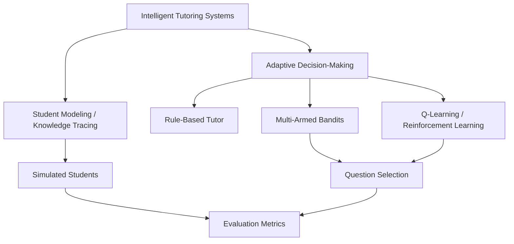

# Literature Map

This literature map organizes the main background areas for the adaptive math tutor project. The goal is to show how the education side and the AI side connect to the final comparison between a rule-based tutor, a bandit-based tutor, and a Q-learning tutor.

## Big Picture

## 1. Intelligent Tutoring Systems

This area gives the overall motivation for the project.

- Focus: how tutoring systems personalize instruction
- Why it matters: this explains why adaptive tutoring is useful in math learning
- Connection to project: this is the broad research area that your tutor belongs to

Main takeaway:
An intelligent tutor should respond to student progress rather than give every student the same sequence of questions.

## 2. Student Modeling and Knowledge Tracing

This area focuses on estimating what a student knows over time.

- Focus: student mastery, progress, and learning state
- Why it matters: the tutor needs some way to represent how the student is doing
- Connection to project: even though Method v1 uses simple rules, later methods like bandits and Q-learning depend on a meaningful student state

Main takeaway:
To adapt well, the tutor needs a model of the student's current understanding.

## 3. Rule-Based Adaptive Tutoring

This is the simplest method in the project and serves as the baseline.

- Focus: hand-written tutoring rules
- Why it matters: this gives a clear and interpretable starting point
- Connection to project: this is Method v1

Examples of rules:

- 3 correct in a row -> increase difficulty
- 2 wrong in a row -> decrease difficulty
- struggling student -> easier or review question

Main takeaway:
Rule-based adaptation is simple and understandable, which makes it a useful baseline for comparison.

## 4. Multi-Armed Bandits

This area covers simple online learning methods that choose among actions and improve from feedback.

- Focus: choosing which type of question to give
- Why it matters: bandits can learn which actions tend to work best without needing a full state-based model
- Connection to project: this is the second tutoring strategy you want to compare

In this project, a bandit could learn whether review, medium, or challenge questions tend to help students the most.

Main takeaway:
Bandits add learning and exploration, but they are usually less state-aware than full reinforcement learning.

## 5. Reinforcement Learning and Q-Learning

This area covers state-based decision-making.

- Focus: learning the best action for a specific student situation
- Why it matters: Q-learning can adapt decisions based on how the student is currently performing
- Connection to project: this is the most advanced strategy in your comparison

Example:

- state = recent accuracy, difficulty level, or mastery estimate
- action = easy, medium, hard, or review question
- reward = progress, correct response, or learning gain

Main takeaway:
Q-learning is more personalized than a bandit because it uses the student's current state when choosing actions.

## 6. Simulated Students

This area supports the experimental design.

- Focus: creating fake learners with different skill levels and learning rates
- Why it matters: simulation makes the project manageable and lets you compare methods fairly
- Connection to project: your current experiments use fast, struggling, and uneven learners

Main takeaway:
Simulated students make it possible to test tutor behavior before using real student data.

## 7. Evaluation and Metrics

This area defines how you will decide which method works best.

- Focus: how to measure learning outcomes
- Why it matters: adaptive systems should be judged by actual learning, not just easy correct answers
- Connection to project: your current metrics are starting mastery, ending mastery, learning gain, success rate, and questions to mastery

Main takeaway:
A strong evaluation should reward real learning and efficient progress toward mastery.

## How the Literature Connects to the Project

You can describe the map like this:

1. Intelligent tutoring systems explain why adaptation matters.
2. Student modeling explains how to represent student progress.
3. Rule-based methods provide the baseline.
4. Bandits provide a simple learning-based adaptive strategy.
5. Q-learning provides a state-based adaptive strategy.
6. Simulated students make the comparison practical.
7. Evaluation metrics determine which method is most effective.

## Short Version for Meetings

"My literature map has two main sides. One side is the education side, which includes intelligent tutoring systems and student modeling. The other side is the decision-making side, which includes rule-based methods, bandits, and Q-learning. Then those come together in my simulated student setup and evaluation metrics, which let me compare which tutoring strategy helps students learn most effectively."
